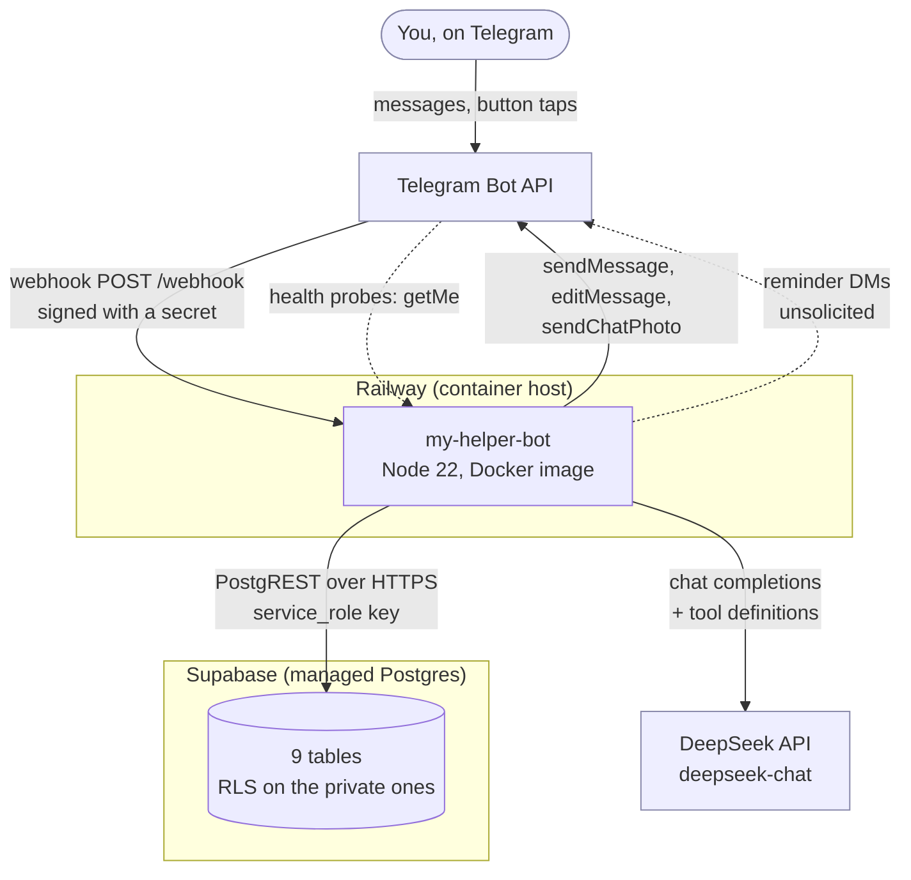
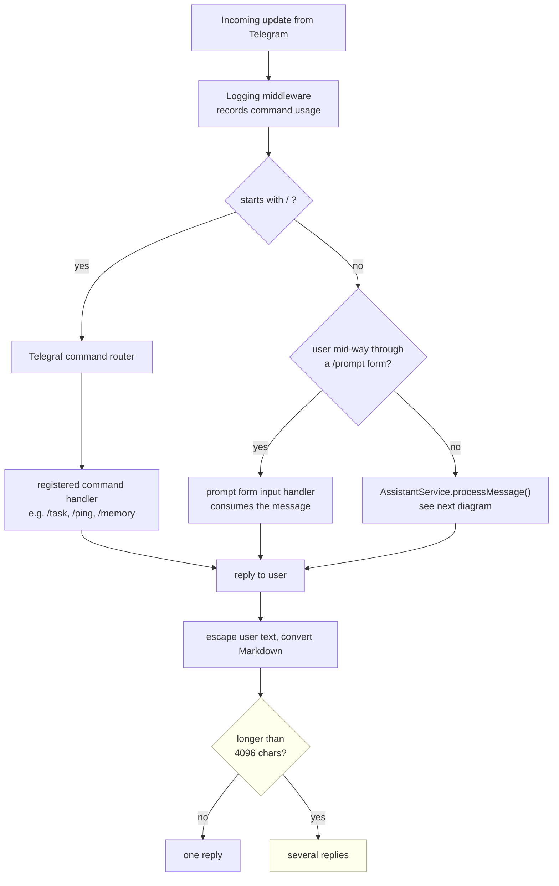
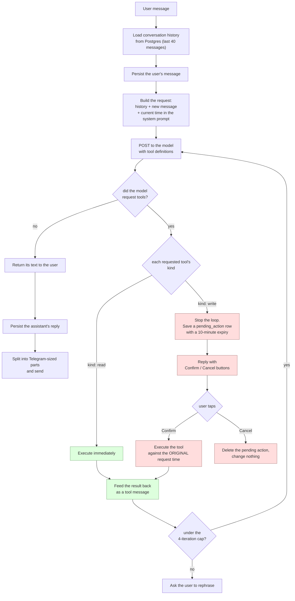
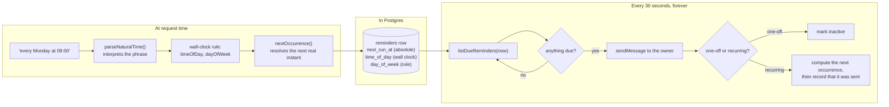
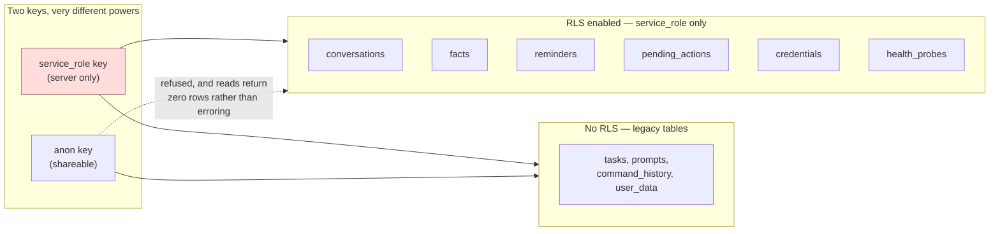
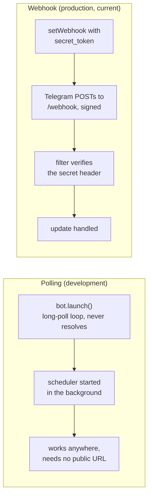
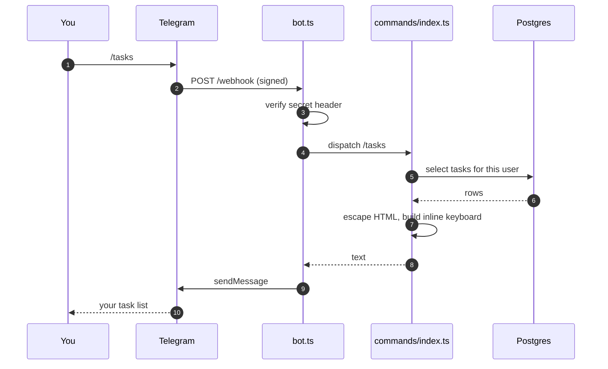
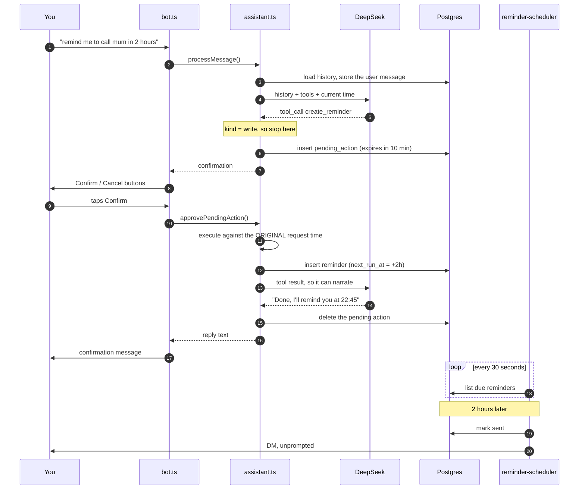

# System Architecture

How the assistant is put together, why it is shaped this way, and where each
responsibility lives. Diagrams are Mermaid, so they render on GitHub and in any
Markdown viewer that supports it.

If you only read one section: **[§4 The tool-calling loop](#4-the-tool-calling-loop)**
is the part that does the actual work.

---

## 1. System context

Who talks to whom, and what is outside the codebase.

Two things are worth noticing.

**Telegram is bidirectional.** It pushes updates to the bot, and the bot also pushes
messages Telegram never asked for — a reminder firing at 09:00 is outbound-initiated,
which is why the service has to be always-on rather than request-driven.

**Supabase is reached over PostgREST, not a SQL connection.** The running bot speaks
HTTP; `psql` is only used by `npm run db:migrate` from a developer machine. That is why
the schema file has to be applied by a separate script — PostgREST cannot execute DDL.

---

## 2. Runtime components

The internal shape of `src/`, grouped by the layer each file belongs to.

```mermaid
flowchart TB
    subgraph Entry["Entry point"]
        index["index.ts<br/>boots Bot, exits non-zero on failure"]
    end

    subgraph BotLayer["Bot layer"]
        bot["bot.ts<br/>Telegraf wiring, HTTP server,<br/>lifecycle, shutdown"]
    end

    subgraph Commands["Commands (explicit /commands)"]
        cmdIndex["commands/index.ts<br/>start, help, ping, task, tasks,<br/>status, stats"]
        cmdAssistant["commands/assistant-commands.ts<br/>forget, memory"]
        cmdPrompt["commands/prompt.ts<br/>multi-step prompt form"]
        cmdGetPrompt["commands/getprompt.ts<br/>search + pagination"]
    end

    subgraph Assistant["Assistant (free-form text)"]
        assistant["services/assistant.ts<br/>the conversation loop,<br/>tool dispatch, confirmations"]
    end

    subgraph AILayer["Model providers"]
        aiClient["services/ai-client.ts<br/>AIClient + AgentMessage<br/>(provider-neutral contract)"]
        aiProvider["services/ai-provider.ts<br/>picks a provider from config"]
        deepseek["services/deepseek-provider.ts"]
        gemini["services/gemini-provider.ts"]
    end

    subgraph Tools["Tool layer"]
        registry["tools/registry.ts<br/>registry + argument validation"]
        builtin["tools/builtin-tools.ts<br/>the 8 callable tools"]
    end

    subgraph Persistence["Persistence"]
        storeIface["services/assistant-store.ts<br/>AssistantStore interface"]
        supabaseStore["services/supabase-assistant-store.ts"]
        memStore["services/in-memory-assistant-store.ts"]
        db["services/database.ts<br/>shared Supabase client,<br/>tasks and prompts"]
    end

    subgraph Background["Background work"]
        scheduler["services/reminder-scheduler.ts<br/>30s poll, delivery"]
        remTime["services/reminder-time.ts<br/>timezone maths, NL time parsing"]
    end

    subgraph Support["Support"]
        env["config/env.ts<br/>lazy config"]
        health["services/health.ts"]
        logger["services/logger.ts"]
        fmt["utils/telegram-format.ts<br/>escaping, Markdown to HTML"]
        chunk["utils/telegram-chunk.ts<br/>splits long messages"]
    end

    index --> bot
    bot --> cmdIndex
    bot --> cmdAssistant
    bot --> assistant
    bot --> scheduler
    bot --> health

    cmdIndex --> cmdPrompt
    cmdIndex --> cmdGetPrompt
    cmdAssistant --> storeIface
    cmdIndex --> db

    assistant --> aiClient
    assistant --> registry
    assistant --> storeIface
    assistant --> chunk
    assistant --> fmt

    aiProvider --> deepseek
    aiProvider --> gemini
    deepseek -.implements.-> aiClient
    gemini -.implements.-> aiClient

    scheduler --> remTime
    scheduler --> storeIface
    builtin --> remTime

    supabaseStore -.implements.-> storeIface
    memStore -.implements.-> storeIface
    supabaseStore --> db
    cmdPrompt --> db
    cmdGetPrompt --> db

    bot --> env
    supabaseStore --> env
    deepseek --> env
    gemini --> env

    classDef iface fill:#dfd,stroke:#7a7
    class storeIface,aiClient iface
```

The green nodes are **interfaces**. They exist so the assistant loop, the reminder
scheduler and every test can run without a database, a network or an API key. In
production the Supabase store and a real provider are injected; in tests, an in-memory
store and a scripted provider are.

---

## 3. How a message is routed

Two entirely different paths share one bot. Which one runs is decided by whether the
text starts with `/`.

The form check runs **before** the assistant on purpose. A multi-step command like
`/prompt` collects free text, which would otherwise be swallowed by the model as a chat
message. The early return is what keeps those two features from fighting.

---

## 4. The tool-calling loop

This is the core of the assistant. The model is given a set of tools; whether a tool
runs immediately or waits for your tap is decided by one field on the tool definition.

Three decisions in here are load-bearing:

**Read and write tools are treated differently.** A read (`list_reminders`) is safe and
invisible, so it runs inline. A write (`create_reminder`) changes your data, so the loop
*stops* and asks. The whole "nothing happens without a tap" guarantee is that one branch.

**Confirmed actions execute against the time you asked, not the time you tapped.** If you
say "remind me in 5 minutes" and confirm ten minutes later, the reminder is still five
minutes from your original request. This is why the pending action stores the original
timestamp.

**The loop is capped at 4 iterations.** A model that keeps requesting tools would
otherwise spin forever; the cap turns a stuck loop into a polite request to rephrase.

### Tools the model can call

| Tool | Kind | Purpose |
| --- | --- | --- |
| `current_time` | read | Local time and timezone |
| `list_facts` | read | Everything remembered about you |
| `list_reminders` | read | Currently scheduled reminders |
| `list_todos` | read | Open tasks |
| `save_fact` | **write** | Remember a preference |
| `create_reminder` | **write** | Schedule a reminder |
| `cancel_reminder` | **write** | Cancel one |
| `add_todo` | **write** | Add a task |

Argument validation is the only gate between model output and a side effect. It rejects
unknown parameters outright, so a confused model fails loudly rather than silently
ignoring a field it invented.

---

## 5. Reminders and time

Reminders are the one feature that has to work while you are not looking, and the one
place where timezones genuinely matter.

**Why store both an instant and a rule.** `next_run_at` answers "when does this fire
next" cheaply and is what the poll queries. But a rule expressed only as an instant
drifts across daylight-saving changes — "every Monday 09:00" would become 08:00. Keeping
`time_of_day` and `day_of_week` lets each occurrence be recomputed in local terms, so
the wall-clock time is stable.

**Delivery is at-least-once, deliberately.** The reminder is marked sent only after the
message actually goes out. If the process dies in between, you may get a duplicate —
which is a far better failure than silence. A reminder whose time passed while the
service was down arrives marked "(missed earlier)" rather than being dropped.

---

## 6. Data model

Nine tables. The five marked RLS are closed to the public key entirely.

```mermaid
erDiagram
    conversations {
        bigserial id PK
        bigint user_id
        text role "user | model"
        text content
        timestamptz created_at
    }
    facts {
        bigserial id PK
        bigint user_id
        text key
        text value
        timestamptz updated_at
    }
    reminders {
        bigserial id PK
        bigint user_id
        text text
        timestamptz next_run_at
        text frequency "once|daily|weekly|monthly"
        text time_of_day "HH:MM"
        smallint day_of_week
        smallint day_of_month
        boolean active
        timestamptz last_sent_at
    }
    pending_actions {
        bigserial id PK
        bigint user_id
        text tool_name
        jsonb args
        jsonb model_parts "the paused turn"
        timestamptz expires_at
    }
    credentials {
        bigserial id PK
        bigint user_id
        text provider
        jsonb secret
    }
    health_probes {
        text id PK "fixed key"
        timestamptz checked_at
    }
    tasks {
        bigserial id PK
        bigint user_id
        text name
        text description
        boolean completed
        timestamptz created_at
    }
    prompts {
        bigserial id PK
        bigint user_id
        text title
        text prompt
        text_array tags
        text image_file_id
    }
    command_history {
        bigserial id PK
        bigint user_id
        text command
        timestamptz created_at
    }
```

`user_data` is the ninth table and holds generic key/value JSON; it is unused by the
current features but part of the original schema.

### Row Level Security

The behaviour of the anon key against a protected table is the important detail: **it
does not error, it returns zero rows.** A health check that only ran a `SELECT` would
therefore report everything fine while the bot silently remembered nothing. That is why
the readiness probe performs a **write**, and why it writes to a dedicated
`health_probes` table with a fixed primary key — a monitor polling every 30 seconds
must never be able to accumulate rows or burn through a sequence.

---

## 7. Deployment

Two modes, and the difference is not cosmetic: a reminder can only fire if the process
is alive.

The deployed service runs webhook mode on Railway behind a generated HTTPS domain.
Two configuration details that were bugs before they were features:

**`launch()` never resolves while polling.** Awaiting it blocks everything after it —
which is exactly how the reminder scheduler silently never started. It is therefore
started in the background, and a rejected launch is retried with backoff rather than
treated as fatal, because a network blip should not take the service down while a bad
token never recovers on its own.

**Liveness and readiness are separate endpoints.**

| Endpoint | Question | Fails when | Used by |
| --- | --- | --- | --- |
| `/health` | Can this process serve? | Telegram unreachable | Railway's healthcheck |
| `/ready` | Can the assistant work? | Database not writable | You, UptimeRobot |

Collapsing them would be a mistake: pointing the platform healthcheck at a
database-inclusive check means a Supabase blip triggers restarts, which cannot repair a
database and can park the service in a crash loop.

---

## 8. Key flows, start to finish

### Explicit command (no model involved)

### A reminder, including the confirmation gate

The unprompted DM at the end is the point of the whole system, and the reason the
service must be running when you are not.

---

## 9. Architectural decisions worth knowing

**Single user, by design.** There is no multi-tenancy, no sign-up, no billing. Every
table is keyed by `user_id` so the shape allows it later, but nothing else is built for
it. `ADMIN_USER_ID` is both the admin gate and the destination for reminders.

**The model layer is provider-neutral.** `AIClient` speaks a neutral `AgentMessage`
conversation; each provider translates to its own wire format. Swapping DeepSeek for
Gemini was a new file plus a translation, with no changes to the loop or its tests. The
translation functions are exported specifically so they can be asserted without a
network call.

**Dependencies that touch time, the model or the database are injected.** `AssistantStore`,
`AIClient`, `ToolRegistry` and `Clock` are all interfaces with in-memory or scripted
implementations. That is why 95 tests run with no credentials and no network. If a new
feature is hard to test, that is the signal it should take its dependency as a
parameter.

**User text is never interpolated into a parsed message.** Telegram rejects an entire
message when a parse-mode character is malformed, so all user-supplied text goes through
`escapeHtml()` and model output through `markdownToTelegramHtml()`. Both are in
`utils/telegram-format.ts`.

**Long replies are chunked rather than truncated.** Telegram's limit is 4096 *visible*
characters, and markup does not count toward it. `utils/telegram-chunk.ts` walks the
source one visible character at a time, recording a legal cut after each — which is what
makes "never cut a tag or entity" true by construction rather than by hoping.

---

## 10. Known gaps

Written down rather than left implied:

- **Reminder repeat is one weekday per reminder.** "Every weekday" anchors to Monday;
  there is no multi-day schedule.
- **`user_data` is unused.** It came with the original scaffold and nothing reads it.
- **Conversation history is capped, not summarised.** Beyond 40 messages, older turns
  simply are not sent — there is no compression.
- **Deploys are manual.** The Railway service was created by uploading the working tree,
  so it is not connected to GitHub and does not redeploy on push.
- **No integration tests against a live Telegram.** The webhook path is covered with the
  API stubbed; delivery is verified by using the bot.
- **Calendar, weather, maps and restaurants remain unbuilt** — deliberately parked until
  the daily-driver loop has proven itself.
