# System Architecture

How the assistant is put together, why it is shaped this way, and where each responsibility lives. Diagrams are Mermaid, so they render on GitHub and in any Markdown viewer that supports it. When adding one, keep it narrower than about 1200px (GitHub scales wider diagrams down until the text is unreadable) and give every `classDef` an explicit `color:` so the text stays visible on the dark theme.

If you only read one section: **[§4 The tool-calling loop](#4-the-tool-calling-loop)** is the part that does the actual work.

---

## What the bot can do today

A plain summary of the features that exist right now, before the internals. The full command reference is in [commands.md](commands.md); what is deliberately missing is in [§10 Known gaps](#10-known-gaps).

### Talk to it

Any message that does not start with `/` goes to the model, which can call tools against your own data. The last 40 messages are sent as context, so it can follow a conversation; `/forget` wipes that history.

| You say | What happens |
| --- | --- |
| "what time is it?" | Answered from the `current_time` tool, no confirmation |
| "remember I'm allergic to peanuts" | Proposes `save_fact`; stored once you tap Confirm |
| "what do you know about me?" | Reads back your facts and scheduled reminders |
| "remind me to call mum in 2 hours" | Proposes `create_reminder`; a DM arrives two hours later |
| "every Monday at 9am remind me to take the bins out" | Weekly reminder that stays at 09:00 across DST changes |
| "cancel reminder 3" | Proposes `cancel_reminder` for that id |
| "add buy milk to my todo list" | Proposes `add_todo`; the task then shows up in `/tasks` |
| "what's on my list?" | Lists your open tasks |

**Nothing that changes your data happens without a Confirm tap.** Read-only tools run silently. A write stops the conversation and shows Confirm / Cancel buttons, which expire after 10 minutes.

**Time phrases the reminder parser understands:** "in 30 minutes", "in 2 hours", "in 3 days", "today at 18:00", "tonight at 8pm", "tomorrow at 07:30", "monday at 09:00", "every day at 09:00", "every monday at 09:00", and an ISO timestamp. "every weekday" is accepted but anchors to Monday only. Reminders live in Postgres, so they survive restarts, and one that came due while the bot was down is delivered marked "(missed earlier)".

### Commands

| Command | What it does |
| --- | --- |
| `/start`, `/help`, `/ping` | Welcome message, command list, liveness check |
| `/task -create` | Interactive form: name, description, submit |
| `/task -read <id>`, `/task -read all` | Show one task, or all of them |
| `/task -update <id>`, `/task -delete <id>` | Edit or delete a task |
| `/tasks` | List your tasks |
| `/prompt` | Save a prompt template: title, text, tags and an optional image |
| `/getprompt` | Search saved prompts, with pagination |
| `/memory` | What the assistant holds about you: facts, reminders and message count |
| `/forget` | Clear conversation history; facts and reminders are kept |
| `/status` | Health, uptime and memory usage (admin only) |
| `/stats` | Command totals and top commands (admin only) |

### Operating it

- Runs 24/7 on Railway in webhook mode; the Docker image runs on any container host.
- `/health` says whether the process is up and `/ready` whether the database is writable, so a monitor can tell "restart me" apart from "the database is down".
- Anyone who finds the bot can chat with it, and each user's facts, reminders and tasks are stored under their own id. Admin commands are gated by `ADMIN_USER_ID`, and reminder DMs always go to the first id in that list: this is a single-user bot.
- DeepSeek is the default model; Gemini works with one environment variable change.

### Not yet

- No calendar, weather, maps or restaurant lookups.
- Recurring reminders are daily or on one weekday; monthly recurrence exists in the schema but the parser never produces it.
- Conversation history is capped at 40 messages, not summarised.

---

## 1. System context

Who talks to whom, and what is outside the codebase.

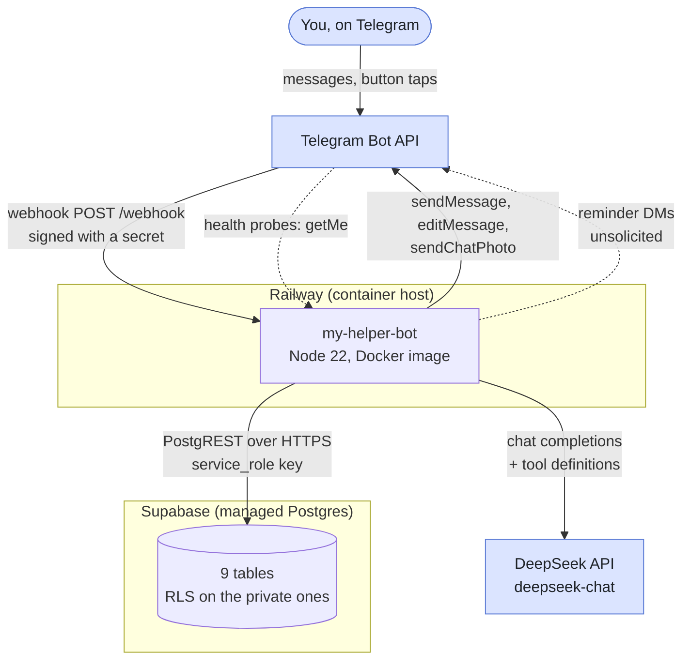

Two things are worth noticing.

**Telegram is bidirectional.** It pushes updates to the bot, and the bot also pushes messages Telegram never asked for — a reminder firing at 09:00 is outbound-initiated, which is why the service has to be always-on rather than request-driven.

**Supabase is reached over PostgREST, not a SQL connection.** The running bot speaks HTTP; `psql` is only used by `npm run db:migrate` from a developer machine. That is why the schema file has to be applied by a separate script — PostgREST cannot execute DDL.

---

## 2. Runtime components

The internal shape of `src/`, grouped by the layer each file belongs to.

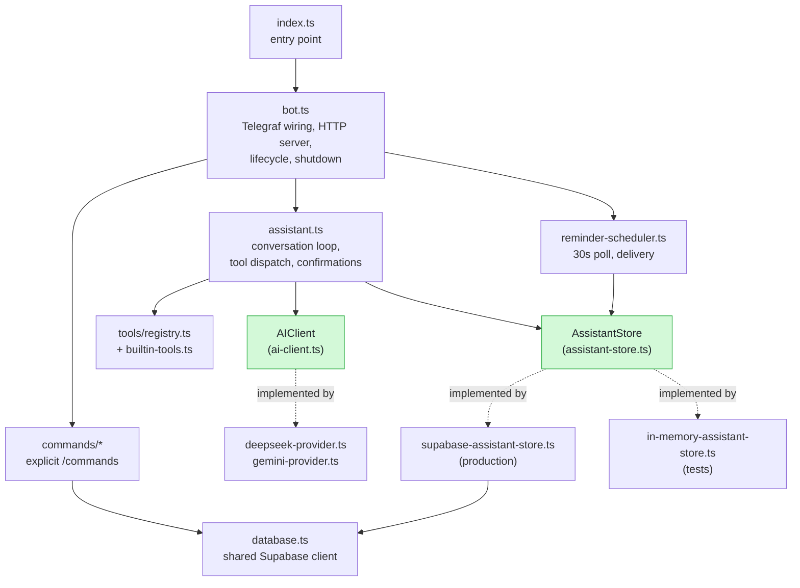

The green nodes are **interfaces**. They exist so the assistant loop, the reminder scheduler and every test can run without a database, a network or an API key. In production the Supabase store and a real provider are injected; in tests, an in-memory store and a scripted provider are.

Every file in `src/`, by layer:

| Layer | File | Responsibility |
| --- | --- | --- |
| Entry | `index.ts` | Boots the bot, exits non-zero on failure |
| Bot | `bot.ts` | Telegraf wiring, HTTP server, lifecycle, shutdown |
| Commands | `commands/index.ts` | `/start`, `/help`, `/ping`, `/task`, `/tasks`, `/status`, `/stats` |
| Commands | `commands/assistant-commands.ts` | `/forget`, `/memory` |
| Commands | `commands/prompt.ts` | Multi-step `/prompt` form |
| Commands | `commands/getprompt.ts` | `/getprompt` search and pagination |
| Assistant | `services/assistant.ts` | The conversation loop, tool dispatch, confirmations |
| Model providers | `services/ai-client.ts` | `AIClient` and `AgentMessage`, the provider-neutral contract |
| Model providers | `services/ai-provider.ts` | Picks a provider from configuration |
| Model providers | `services/deepseek-provider.ts`, `services/gemini-provider.ts` | One implementation per provider |
| Tools | `tools/registry.ts` | Registry and argument validation |
| Tools | `tools/builtin-tools.ts` | The 8 callable tools |
| Persistence | `services/assistant-store.ts` | `AssistantStore` interface |
| Persistence | `services/supabase-assistant-store.ts` | Postgres-backed store (production) |
| Persistence | `services/in-memory-assistant-store.ts` | In-memory store (tests) |
| Persistence | `services/database.ts` | Shared Supabase client, tasks and prompts |
| Background | `services/reminder-scheduler.ts` | 30s poll and delivery |
| Background | `services/reminder-time.ts` | Timezone maths, recurrence, natural-language time parsing |
| Support | `config/env.ts` | Lazy configuration, validated on first read |
| Support | `services/health.ts` | Health snapshot for `/health` and `/status` |
| Support | `services/logger.ts` | Leveled console logger |
| Support | `utils/telegram-format.ts` | HTML escaping, Markdown to Telegram HTML |
| Support | `utils/telegram-chunk.ts` | Splits long messages without cutting a tag |

---

## 3. How a message is routed

Two entirely different paths share one bot. Which one runs is decided by whether the text starts with `/`.

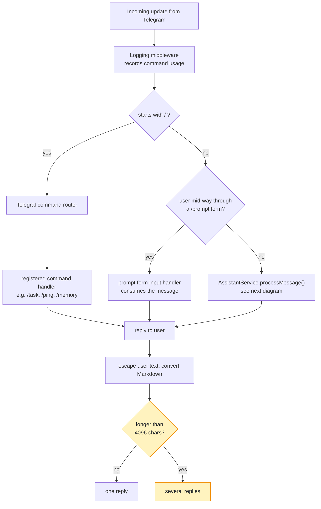

The form check runs **before** the assistant on purpose. A multi-step command like `/prompt` collects free text, which would otherwise be swallowed by the model as a chat message. The early return is what keeps those two features from fighting.

---

## 4. The tool-calling loop

This is the core of the assistant. The model is given a set of tools; whether a tool runs immediately or waits for your tap is decided by one field on the tool definition.

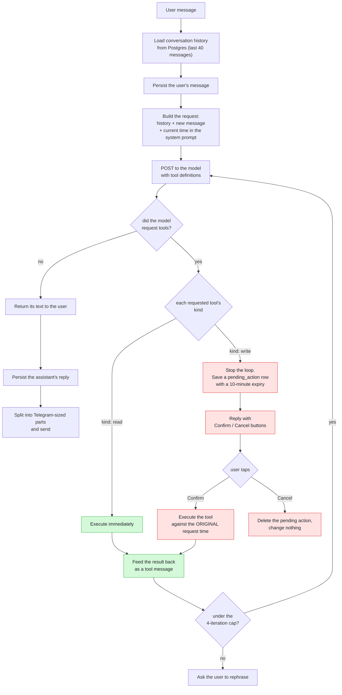

Three decisions in here are load-bearing:

**Read and write tools are treated differently.** A read (`list_reminders`) is safe and invisible, so it runs inline. A write (`create_reminder`) changes your data, so the loop *stops* and asks. The whole "nothing happens without a tap" guarantee is that one branch.

**Confirmed actions execute against the time you asked, not the time you tapped.** If you say "remind me in 5 minutes" and confirm ten minutes later, the reminder is still five minutes from your original request. This is why the pending action stores the original timestamp.

**The loop is capped at 4 iterations.** A model that keeps requesting tools would otherwise spin forever; the cap turns a stuck loop into a polite request to rephrase.

### Tools the model can call

| Tool | Kind | Purpose |
| --- | --- | --- |
| `current_time` | read | Local time and timezone |
| `list_facts` | read | Everything remembered about you |
| `list_reminders` | read | Currently scheduled reminders |
| `list_todos` | read | Open tasks |
| `save_fact` | **write** | Remember a preference |
| `create_reminder` | **write** | Schedule a reminder |
| `cancel_reminder` | **write** | Cancel one |
| `add_todo` | **write** | Add a task |

Argument validation is the only gate between model output and a side effect. It rejects unknown parameters outright, so a confused model fails loudly rather than silently ignoring a field it invented.

---

## 5. Reminders and time

Reminders are the one feature that has to work while you are not looking, and the one place where timezones genuinely matter.

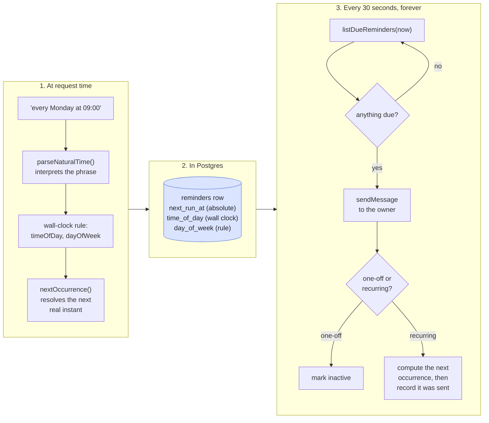

**Why store both an instant and a rule.** `next_run_at` answers "when does this fire next" cheaply and is what the poll queries. But a rule expressed only as an instant drifts across daylight-saving changes — "every Monday 09:00" would become 08:00. Keeping `time_of_day` and `day_of_week` lets each occurrence be recomputed in local terms, so the wall-clock time is stable.

**Delivery is at-least-once, deliberately.** The reminder is marked sent only after the message actually goes out. If the process dies in between, you may get a duplicate — which is a far better failure than silence. A reminder whose time passed while the service was down arrives marked "(missed earlier)" rather than being dropped.

---

## 6. Data model

Nine tables, in two groups. The six assistant tables have Row Level Security and are closed to the public key entirely; the three legacy tables do not.

### Assistant tables (RLS enabled)

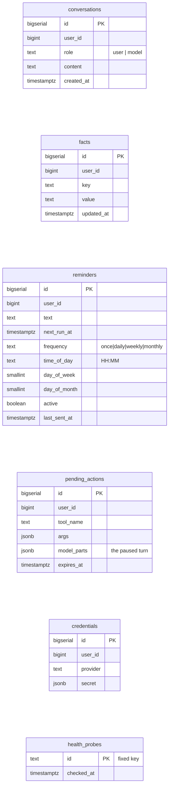

### Legacy tables (no RLS)

Used by the explicit `/task` and `/prompt` commands and the usage middleware.

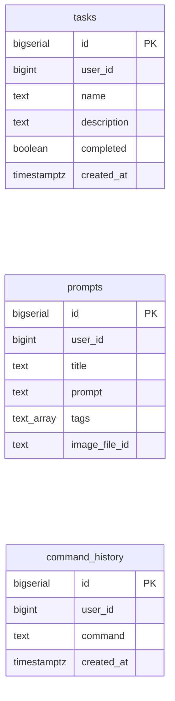

`user_data` is the ninth table and holds generic key/value JSON; it is unused by the current features but part of the original schema.

### Row Level Security

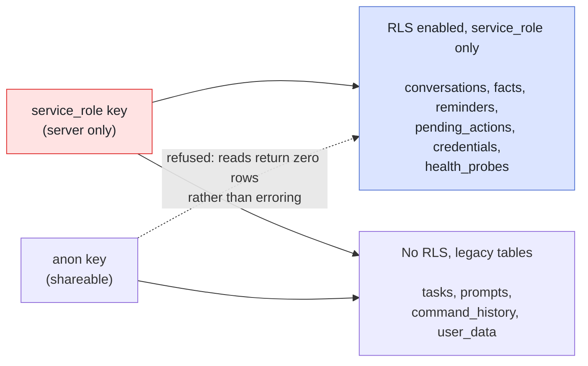

The behaviour of the anon key against a protected table is the important detail: **it does not error, it returns zero rows.** A health check that only ran a `SELECT` would therefore report everything fine while the bot silently remembered nothing. That is why the readiness probe performs a **write**, and why it writes to a dedicated `health_probes` table with a fixed primary key — a monitor polling every 30 seconds must never be able to accumulate rows or burn through a sequence.

---

## 7. Deployment

Two modes, and the difference is not cosmetic: a reminder can only fire if the process is alive.

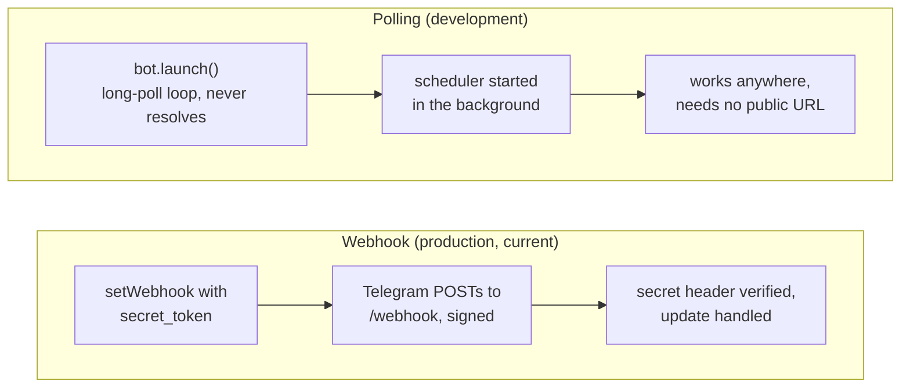

The deployed service runs webhook mode on Railway behind a generated HTTPS domain. Two configuration details that were bugs before they were features:

**`launch()` never resolves while polling.** Awaiting it blocks everything after it — which is exactly how the reminder scheduler silently never started. It is therefore started in the background, and a rejected launch is retried with backoff rather than treated as fatal, because a network blip should not take the service down while a bad token never recovers on its own.

**Liveness and readiness are separate endpoints.**

| Endpoint | Question | Fails when | Used by |
| --- | --- | --- | --- |
| `/health` | Can this process serve? | Telegram unreachable | Railway's healthcheck |
| `/ready` | Can the assistant work? | Database not writable | You, UptimeRobot |

Collapsing them would be a mistake: pointing the platform healthcheck at a database-inclusive check means a Supabase blip triggers restarts, which cannot repair a database and can park the service in a crash loop.

---

## 8. Key flows, start to finish

### Explicit command (no model involved)

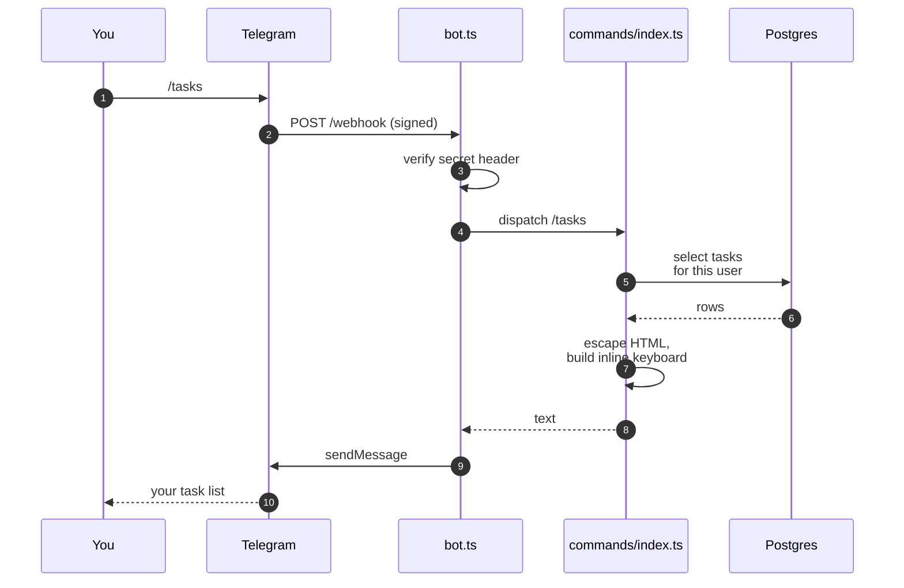

### A reminder, including the confirmation gate

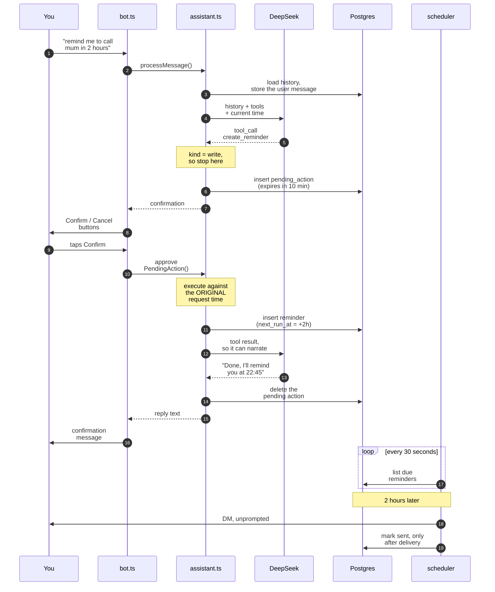

The unprompted DM at the end is the point of the whole system, and the reason the service must be running when you are not.

---

## 9. Architectural decisions worth knowing

**Single user, by design.** There is no multi-tenancy, no sign-up, no billing. Every table is keyed by `user_id` so the shape allows it later, but nothing else is built for it. `ADMIN_USER_ID` is both the admin gate and the destination for reminders.

**The model layer is provider-neutral.** `AIClient` speaks a neutral `AgentMessage` conversation; each provider translates to its own wire format. Swapping DeepSeek for Gemini was a new file plus a translation, with no changes to the loop or its tests. The translation functions are exported specifically so they can be asserted without a network call.

**Dependencies that touch time, the model or the database are injected.** `AssistantStore`, `AIClient`, `ToolRegistry` and `Clock` are all interfaces with in-memory or scripted implementations. That is why 95 tests run with no credentials and no network. If a new feature is hard to test, that is the signal it should take its dependency as a parameter.

**User text is never interpolated into a parsed message.** Telegram rejects an entire message when a parse-mode character is malformed, so all user-supplied text goes through `escapeHtml()` and model output through `markdownToTelegramHtml()`. Both are in `utils/telegram-format.ts`.

**Long replies are chunked rather than truncated.** Telegram's limit is 4096 *visible* characters, and markup does not count toward it. `utils/telegram-chunk.ts` walks the source one visible character at a time, recording a legal cut after each — which is what makes "never cut a tag or entity" true by construction rather than by hoping.

---

## 10. Known gaps

Written down rather than left implied:

- **Reminder repeat is one weekday per reminder.** "Every weekday" anchors to Monday; there is no multi-day schedule.
- **`user_data` is unused.** It came with the original scaffold and nothing reads it.
- **Conversation history is capped, not summarised.** Beyond 40 messages, older turns simply are not sent — there is no compression.
- **Deploys are manual.** The Railway service was created by uploading the working tree, so it is not connected to GitHub and does not redeploy on push.
- **No integration tests against a live Telegram.** The webhook path is covered with the API stubbed; delivery is verified by using the bot.
- **Calendar, weather, maps and restaurants remain unbuilt** — deliberately parked until the daily-driver loop has proven itself.
